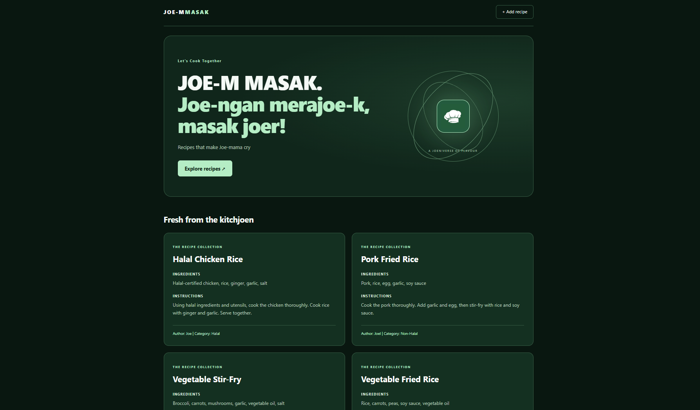

# JOE-M MASAK 🍳

Joe-ngan merajoe-k, makan joer!

## Live Links

- Vercel Backend: https://kitchenbase-backend.vercel.app/
- Railway Backend: https://kitchenbase-backend-production.up.railway.app

## Screenshot

## Features

- View recipes, ingredients, and instructions.
- Display author and category names.
- Add recipes with an author and category.
- View and add users.
- View halal, non-halal, and vegetarian categories.
- Show error alerts when requests fail.
- Responsive green design with SpotlightCard effects.

## Technologies

React, Vite, CSS, Express, Supabase, and Railway.

## Foreign Keys

- `recipe.author` connects to `users.id`.
- `recipe.category` connects to `categories.id`.

These relationships connect each recipe to its author and category.

## Error Handling

Expected API responses:

- `400`: Missing or invalid input.
- `404`: Recipe or route not found.
- `409`: Duplicate username or email.
- `500`: Unexpected server error.

The frontend displays error alerts when creation requests fail.

## Testing

- Test all six endpoints in Postman.
- Confirm new users and recipes are saved.
- Test missing fields, duplicate users, and invalid IDs.
- Check that the frontend loads data from Railway.